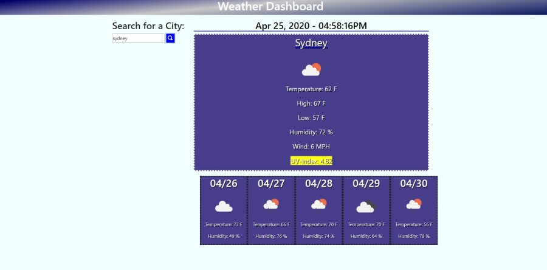

<h1 align="center">Weather Dashboard</h1>

    
    
    
    
    
    
    

  

    

  

## Table of Contents
- [Description](#description)
- [Installation](#install)
- [Usage](#usage)
- [Questions](#questions)

## Description
This is a simple app that uses server based API's to look up any city. It will bring back info of the current days forecast and a five day forecast for that city.   
  
## Install
Clone Repo to computer

## Usage
Open index.html

## Below is a link to the GitHub repository   

[Weather Dashboard Github Repo](https://github.com/mattkohl82/weather-dashboard)    

### Deployed app
[Weather Dashboard Deployed APP](https://mattkohl82.github.io/weather-dashboard/) 

## Questions

#### [Mattkohl82 for GitHub](https://github.com/Mattkohl82) 
 
#### mattkohl82@gmail.com for ✉️ email 
