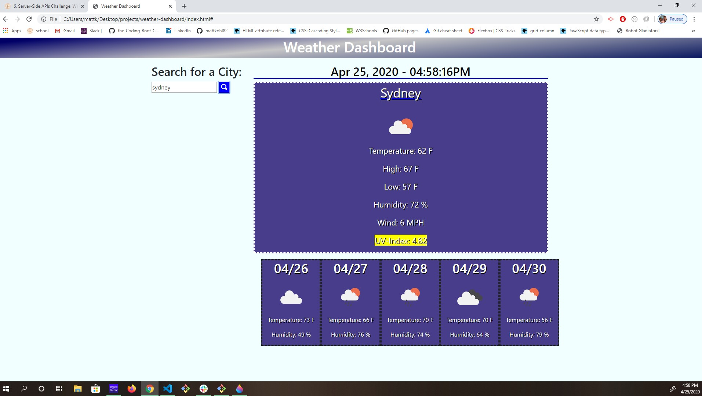
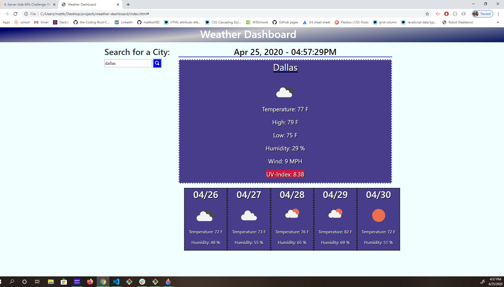

# Weather Dashboard 

link to working site
https://mattkohl82.github.io/weather-dashboard/

link to github site
https://github.com/mattkohl82/weather-dashboard

This is a simple app that uses server based API's to look up any city. It will bring back info of the current days forecast and a five day forecast for that city. 

### How to use
You simply type whatever city you would like to know the weather info about and it will retrieve it for you. 

## Tools used
- Basic HTML, CSS, and JS
- Bootstrap 4
- JQuery
- Moment JS

## Improvements needed
I was able to save to localstorage but not repopulate the page with items from localstorage.

